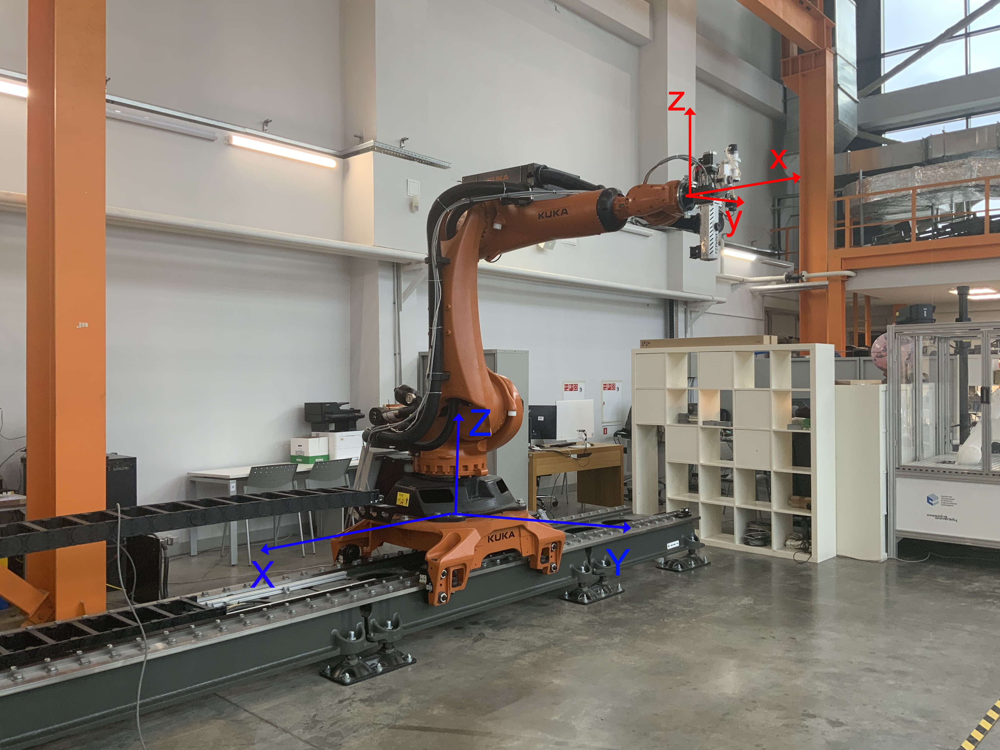
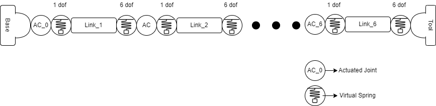
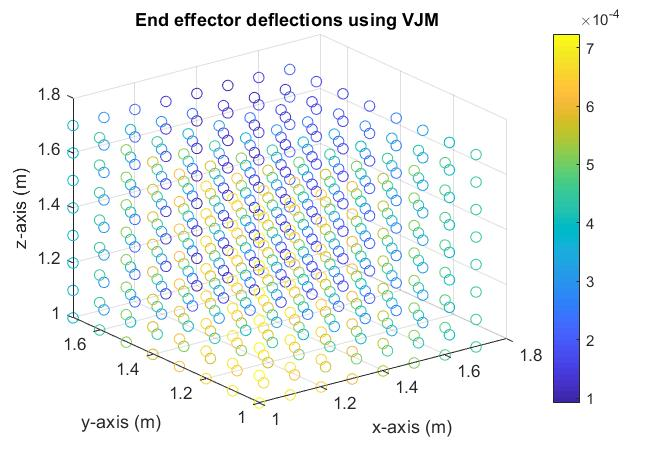

# VJM Analysis for 7DOF Kuka kr-210 r-2700 on Linear Axis

This project contains Matlab implementation for applying: 
* VJM model
* Elastostatic calibration
* Geometric calibration
* Redundancy resolution

on Robot Kuka kr-210 r-2700 manipulator mounted on a linear axis. 

The robot used in this project is shown below:
<p align="center"></p>

In the figure, blue origin is base origin. All measured points are in this origin. Red origin is tool origin. All tools are in this origin.
The configuration on the image: [0,-90,90,0,0,0] and all measurements are in mm and deg.

Since this robot with linear axis has 7 degrees of freedom, it become redundant and the solution for inverse kinematics can have many solutions.To solve this problem, redundancy resolution is applied. Three different approached were used for redundancy resolution: Damped Least Square (DLS), Task Augmentation, Weighted​ Pseudoinverse.

Also, to perfrom robot calibration, end effector poses are collected with different joint configurations using optical tracking record. These data are found in ```configurations.txt``` and ```points.txt```.

## Results:

### VJM

The schematic for the robot joints and links needed for VJM analysis were as follows:

<p align="center"></p>

The deflections on the end effector with a force of 50N in the three translation axes were:
hk,h, j
<p align="center"></p>


### Elastostatic Calibrations

Circle trajectory is used to validate the model after implementing Elastostatic calibration:

<p align="center"></p>


### REDUNDANCY RESOLUTION
Comparison between the three methods used is represented in table below:

| Property/Approach             | DLS    | Task Augmentation | Pseudoinverse 
| ----------------------- |:--------|:-----------|:--------|
| No. iterations​          |  6263   |785         |6255    |
| Total time (s) *         | 13.8    |2.13        |14.66    |

*Termination condition at 2% accuracy.

A sample result for the inverse kinematics solution using Task Augmentation is shown below.
<p align="center"></p>


## Folder Structure
Since this project contains multiple .m files that executes certain function, the following structure contains the main files.
```
└── Main
       ├── FK.m                 <-- forward kinematics
       ├── IK.m                 <-- inverse kinematics using any chosen redundancy resolution method
       ├── VJM_main.m           <-- implements VJM analysis 
       ├── elastostatic_calib_main.m           <-- perform  elastostatic calibration
       ├── G_calibration_main.m                <-- perform  geometric calibration 
       ├── configurations.txt   <-- contains robot configurations
       └──  points.txt           <-- contains raw data for every measured point
       
├── Results
└── utils   <-- contains the rotation and translation matrices
```
## Note:
This project was part of *Advanced Robotics* course (Spring 2022) by Prof. Alexander Klimchik.

## References
1. A. Klimchik, A. Pashkevich, and D. Chablat, “Fundamentals of manipulator stiffness modeling using matrix structural analysis,” Mechanism and Machine Theory, vol. 133, pp. 365–394, 2019.
2. D. Popov, V. Skvortsova, και A. Klimchik, ‘Stiffness modeling of 3RRR parallel spherical manipulator’, στο ITTCS, 2019.
3. Chaker, A., Mlika, A., Laribi, M.A. et al. Synthesis of spherical parallel manipulator for dexterous medical task. Front. Mech. Eng. 7, 150–162, 2012. 
4. H. Saafi, M. A. Laribi, και S. Zeghloul, ‘Resolution of spherical parallel Manipulator (SPM) forward kinematic model (FKM) near the singularity’, 2013
5. Lecture notes for "Advanced Robotics" by prof A. Klimchik


